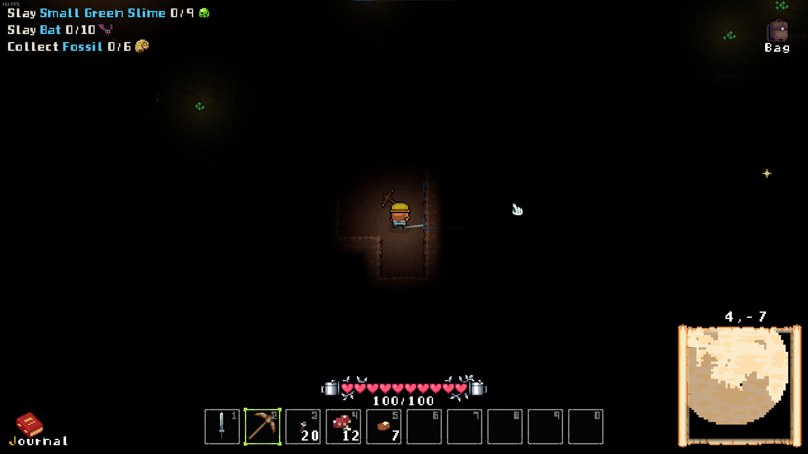

# Pitch Dark

Changes the player and torch lights to be have a shorter range.
Without a torch or Gloweed, it's pitch dark.




## Installation

This mod requires BepInEx to work, it's a modding framework that allows multiple mods being loaded. Furthermore, Harmony is used to patch into the game, which means no game code is distributed and allows multiple mods to change it interdependent.

1. Download BepInEx from https://github.com/BepInEx/BepInEx/releases
2. Extract all files to your Below The Stone folder. It should look like this:\
   
3. Optional: start the game once. Afterwards you will see a config file in BepInEx/config/ called `BepInEx.cfg`. Open it and set `Enabled = true` under `[Logging.Console]` to see loaded mods and errors immediately.
4. Download this mod from [Releases](https://github.com/MSchmoecker/PitchDark/releases) and extract it into BepInEx/plugins/
5. Launch the game!


## Configuration

The config file is located in `BepInEx/config/com.maxsch.BelowTheStone.PitchDark.cfg` after you launched the game once with the mod installed.

Both player and torch light radius ranges can be configured separately.


## Development

1. Install BepInEx
2. Create a file called `Environment.props` in the root folder (one folder above the PitchDark.csproj file) and add the following content:
   ```xml
   <?xml version="1.0" encoding="utf-8"?>
   <Project ToolsVersion="Current" xmlns="http://schemas.microsoft.com/developer/msbuild/2003">
       <PropertyGroup>
           <BELOW_THE_STONE_INSTALL>C:/Program Files/Steam/steamapps/common/Below The Stone</BELOW_THE_STONE_INSTALL>
           <MOD_DEPLOYPATH>$(BELOW_THE_STONE_INSTALL)/BepInEx/plugins</MOD_DEPLOYPATH>
       </PropertyGroup>
   </Project>
   ```
3. Compile the project. This copies the resulting dll into the `MOD_DEPLOYPATH`, if set
